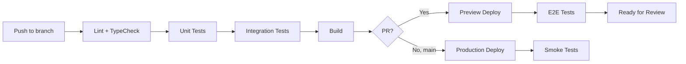

# Plan Testów - Lawly MVP

## 1. Wprowadzenie i cele testowania

### 1.1 Cel dokumentu
Niniejszy dokument stanowi kompleksowy plan testów dla aplikacji Lawly - systemu automatycznego generowania fragmentów dokumentów SOW (Statement of Work) dla zespołu sprzedażowego.

### 1.2 Cele testowania
- **Zapewnienie jakości**: Weryfikacja poprawności działania wszystkich funkcjonalności zgodnie z PRD
- **Stabilność**: Identyfikacja i eliminacja błędów przed wdrożeniem produkcyjnym
- **Bezpieczeństwo**: Potwierdzenie prawidłowej implementacji mechanizmów autoryzacji i izolacji danych
- **Użyteczność**: Weryfikacja intuicyjności interfejsu i poprawności przepływów użytkownika
- **Zgodność z wymaganiami**: Upewnienie się, że wszystkie User Stories (US-001 do US-027) są zaimplementowane poprawnie

### 1.3 Zakres projektu
Lawly to wewnętrzne narzędzie webowe umożliwiające:
- Logowanie przez Google SSO
- Przechodzenie przez wizard 5 pytań single-select
- Automatyczne generowanie fragmentów SOW na podstawie odpowiedzi
- Przeglądanie historii ukończonych sesji
- Kopiowanie wygenerowanych fragmentów

---

## 2. Zakres testów

### 2.1 Funkcjonalności objęte testami

| Moduł | Komponenty | Priorytet |
|-------|-----------|-----------|
| Autentykacja | Google SSO, sesje, wylogowanie, middleware | Krytyczny |
| Wizard | Pytania, odpowiedzi, nawigacja, walidacja | Krytyczny |
| Generowanie fragmentów | Mapowanie odpowiedzi, zapis sesji | Krytyczny |
| Historia sesji | Lista, szczegóły, paginacja | Wysoki |
| Profil użytkownika | Onboarding, welcome screen | Wysoki |
| Kopiowanie do schowka | Przycisk "Kopiuj wszystko" | Średni |
| Obsługa błędów | Komunikaty, retry, error boundaries | Średni |
| UI/UX | Responsywność, accessibility | Niski |

### 2.2 Funkcjonalności wyłączone z zakresu
- Testy obciążeniowe (MVP obsługuje max 10 użytkowników dziennie)
- Testy kompatybilności z przeglądarkami mobilnymi (poza scope MVP)
- Testy integracji z zewnętrznymi systemami (CRM, Slack - nie w MVP)
- Panel administracyjny (nie istnieje w MVP)

---

## 3. Typy testów do przeprowadzenia

### 3.1 Testy jednostkowe (Unit Tests)

**Technologia**: Vitest + Testing Library

**Zakres**:
- **Schematy walidacji Zod**:
  - `getSessionsQuerySchema` - walidacja parametrów paginacji
  - `createSessionCommandSchema` - walidacja struktury odpowiedzi (dokładnie 5 odpowiedzi)
  - `sessionIdParamSchema` - walidacja UUID sesji
  - `updateProfileSchema` - walidacja aktualizacji profilu

- **Funkcje serwisowe**:
  - `findDuplicateQuestionId()` - wykrywanie duplikatów
  - `validateAnswersAgainstQuestions()` - walidacja odpowiedzi względem pytań
  - `generateSowFragments()` - generowanie fragmentów w odpowiedniej kolejności
  - `formatSessionDate()` - formatowanie dat w lokalizacji polskiej

- **Custom Hooks** (z użyciem `@testing-library/react`):
  - `useWizard` - zarządzanie stanem wizarda
  - `useSessions` - paginacja i pobieranie sesji
  - `useFragmentResults` - obsługa stanów wyników

### 3.2 Testy integracyjne (Integration Tests)

**Technologia**: Vitest + Supertest (dla API) lub MSW (Mock Service Worker)

**Zakres API Endpoints**:

| Endpoint | Metoda | Scenariusze testowe |
|----------|--------|---------------------|
| `/api/profile` | GET | Autoryzowany dostęp, brak autoryzacji, profil nieznaleziony |
| `/api/profile` | PATCH | Aktualizacja `has_seen_welcome`, nieprawidłowe dane |
| `/api/questions` | GET | Pobranie wszystkich pytań, sortowanie wg `question_order` |
| `/api/sessions` | GET | Paginacja, filtry, puste wyniki |
| `/api/sessions` | POST | Tworzenie sesji, walidacja 5 odpowiedzi, duplikaty, nieprawidłowe ID |
| `/api/sessions/[id]` | GET | Szczegóły sesji, RLS (próba dostępu do cudzej sesji) |
| `/api/auth/logout` | POST | Wylogowanie, usunięcie sesji |

**Integracja z Supabase**:
- Weryfikacja poprawności zapytań do bazy danych
- Testy Row Level Security (RLS) policies
- Weryfikacja triggera `on_auth_user_created`

### 3.3 Testy End-to-End (E2E)

**Technologia**: Playwright

**Scenariusze krytyczne**:

1. **Flow rejestracji i logowania**:
   - Logowanie przez Google SSO
   - Przekierowanie po autoryzacji
   - Wyświetlenie welcome screen dla nowego użytkownika
   - Pominięcie welcome screen (link "Przejdź do aplikacji")

2. **Flow wizarda**:
   - Rozpoczęcie nowej sesji
   - Przejście przez wszystkie 5 pytań
   - Walidacja: brak możliwości przejścia bez wyboru odpowiedzi
   - Generowanie fragmentów po ostatnim pytaniu
   - Wyświetlenie wyników z możliwością kopiowania

3. **Flow historii sesji**:
   - Przeglądanie listy ukończonych sesji
   - Paginacja (Load More)
   - Dostęp do szczegółów sesji
   - Kopiowanie fragmentów z historycznej sesji

4. **Flow wylogowania**:
   - Wylogowanie z aplikacji
   - Przekierowanie do strony logowania
   - Brak dostępu do chronionych stron po wylogowaniu

### 3.4 Testy bezpieczeństwa (Security Tests)

**Zakres**:
- **Row Level Security**: Próba dostępu do sesji innego użytkownika
- **Ochrona tras**: Dostęp do chronionych endpointów bez autoryzacji
- **Cookie security**: Weryfikacja flag `httpOnly`, `secure`, `sameSite`
- **Injection prevention**: Próby SQL injection przez parametry API
- **CSRF protection**: Weryfikacja ochrony przed cross-site request forgery

### 3.5 Testy komponentów UI (Component Tests)

**Technologia**: Vitest + Testing Library + Storybook (opcjonalnie)

**Komponenty do przetestowania**:

| Komponent | Przypadki testowe |
|-----------|-------------------|
| `WizardView` | Stany: loading, error, content, completed |
| `QuestionCard` | Wyświetlanie pytania i opcji |
| `AnswerOptions` | Wybór odpowiedzi, wizualna indykacja |
| `ProgressStepper` | Poprawność wskaźnika "Pytanie X z 5" |
| `SessionList` | Stany: loading, empty, error, lista sesji |
| `SessionCard` | Formatowanie daty, stan aktywny |
| `FragmentResultsView` | Wyświetlanie fragmentów, przycisk kopiowania |
| `CopyAllButton` | Kopiowanie do schowka, potwierdzenie |
| `WelcomeCard` | Przycisk CTA, link pominięcia |

### 3.6 Testy dostępności (Accessibility Tests)

**Technologia**: axe-core + Playwright

**Kryteria WCAG 2.1 AA**:
- Nawigacja klawiaturowa (Tab, Enter, Space)
- Role ARIA dla interaktywnych elementów
- Kontrast kolorów
- Fokus widoczny i logiczny
- Alternatywne teksty dla elementów wizualnych
- Poprawna semantyka HTML

---

## 4. Scenariusze testowe dla kluczowych funkcjonalności

### 4.1 Autentykacja (US-001, US-002, US-003)

| ID | Scenariusz | Kroki | Oczekiwany rezultat |
|----|-----------|-------|---------------------|
| TC-AUTH-01 | Logowanie przez Google | 1. Otwórz stronę logowania 2. Kliknij "Zaloguj przez Google" 3. Autoryzuj w Google 4. Oczekuj na callback | Przekierowanie do `/welcome` (nowy użytkownik) lub `/` (powracający) |
| TC-AUTH-02 | Wylogowanie | 1. Zaloguj się 2. Kliknij "Wyloguj" w menu | Przekierowanie do `/login`, sesja usunięta |
| TC-AUTH-03 | Ochrona tras | 1. Bez logowania przejdź do `/wizard` | Przekierowanie do `/login` |
| TC-AUTH-04 | Błąd OAuth | 1. Symuluj błąd w callback | Przekierowanie do `/login?error=oauth` |
| TC-AUTH-05 | Welcome screen | 1. Zaloguj się jako nowy użytkownik | Welcome screen wyświetlony, `has_seen_welcome=false` |
| TC-AUTH-06 | Pominięcie welcome | 1. Na welcome screen kliknij "Przejdź do aplikacji" | Przekierowanie do `/`, `has_seen_welcome=true` |

### 4.2 Wizard pytań (US-004 do US-010)

| ID | Scenariusz | Kroki | Oczekiwany rezultat |
|----|-----------|-------|---------------------|
| TC-WIZ-01 | Rozpoczęcie sesji | 1. Kliknij "Rozpocznij nową sesję" | Przekierowanie do `/wizard`, pytanie 1/5 |
| TC-WIZ-02 | Wybór odpowiedzi | 1. Kliknij opcję odpowiedzi | Opcja wizualnie zaznaczona, przycisk "Dalej" aktywny |
| TC-WIZ-03 | Przycisk Dalej disabled | 1. Na pytaniu nie wybieraj odpowiedzi 2. Sprawdź przycisk "Dalej" | Przycisk w stanie disabled, tooltip informacyjny |
| TC-WIZ-04 | Przejście do kolejnego pytania | 1. Wybierz odpowiedź 2. Kliknij "Dalej" | Wyświetlone pytanie 2/5, wskaźnik zaktualizowany |
| TC-WIZ-05 | Zmiana odpowiedzi | 1. Wybierz odpowiedź A 2. Wybierz odpowiedź B | Tylko odpowiedź B zaznaczona |
| TC-WIZ-06 | Ostatnie pytanie | 1. Przejdź do pytania 5/5 2. Wybierz odpowiedź 3. Kliknij "Zakończ" | Fragmenty wygenerowane, sesja zapisana, przekierowanie do wyników |
| TC-WIZ-07 | Utrata postępu | 1. Rozpocznij sesję 2. Odpowiedz na 2 pytania 3. Odśwież stronę | Postęp utracony, powrót do początku |

### 4.3 Generowanie fragmentów (US-012, US-014, US-015)

| ID | Scenariusz | Kroki | Oczekiwany rezultat |
|----|-----------|-------|---------------------|
| TC-FRAG-01 | Automatyczne generowanie | 1. Ukończ wszystkie 5 pytań | Fragmenty wygenerowane zgodnie z odpowiedziami, w kolejności pytań |
| TC-FRAG-02 | Wyświetlenie fragmentów | 1. Ukończ sesję | Ekran z textarea zawierającym wszystkie fragmenty |
| TC-FRAG-03 | Kopiuj wszystko | 1. Ukończ sesję 2. Kliknij "Kopiuj wszystko" | Potwierdzenie skopiowania, fragmenty w schowku |
| TC-FRAG-04 | Ręczne zaznaczenie | 1. Zaznacz część tekstu w textarea 2. Ctrl+C | Zaznaczony fragment skopiowany |
| TC-FRAG-05 | Zapis do bazy | 1. Ukończ sesję 2. Sprawdź bazę danych | Rekord `sessions` z `completed_at`, `answers`, `generated_fragments` |

### 4.4 Historia sesji (US-018 do US-021)

| ID | Scenariusz | Kroki | Oczekiwany rezultat |
|----|-----------|-------|---------------------|
| TC-HIST-01 | Lista sesji | 1. Ukończ kilka sesji 2. Przejdź do dashboardu | Lista sesji posortowana od najnowszej |
| TC-HIST-02 | Pusta historia | 1. Zaloguj się jako nowy użytkownik bez sesji | Komunikat "Nie masz jeszcze żadnych ukończonych sesji" |
| TC-HIST-03 | Paginacja | 1. Mając >10 sesji 2. Kliknij "Załaduj więcej" | Kolejne sesje załadowane, przycisk znika gdy brak więcej |
| TC-HIST-04 | Szczegóły sesji | 1. Kliknij sesję z listy | Widok z pytaniami, odpowiedziami i fragmentami |
| TC-HIST-05 | Kopiowanie z historii | 1. Otwórz szczegóły sesji 2. Kliknij "Kopiuj wszystko" | Fragmenty skopiowane do schowka |

### 4.5 Obsługa błędów (US-023 do US-027)

| ID | Scenariusz | Kroki | Oczekiwany rezultat |
|----|-----------|-------|---------------------|
| TC-ERR-01 | Błąd połączenia | 1. Symuluj network error | Error screen z komunikatem i przyciskiem "Odśwież" |
| TC-ERR-02 | Błąd ładowania pytań | 1. Symuluj błąd API `/api/questions` | Komunikat "Nie można załadować pytań" |
| TC-ERR-03 | Błąd zapisu sesji | 1. Symuluj błąd POST `/api/sessions` | Komunikat błędu, odpowiedzi zachowane, możliwość retry |
| TC-ERR-04 | Błąd ładowania historii | 1. Symuluj błąd GET `/api/sessions` | Komunikat z przyciskiem "Spróbuj ponownie" |
| TC-ERR-05 | Nieautoryzowany dostęp | 1. Spróbuj otworzyć `/api/sessions/[cudze_id]` | Błąd 403 lub pusty wynik (RLS) |

---

## 5. Środowisko testowe

### 5.1 Środowiska

| Środowisko | Przeznaczenie | URL | Baza danych |
|------------|---------------|-----|-------------|
| Lokalne (Development) | Testy manualne, unit, integracyjne | `localhost:3000` | Supabase Local (Docker) |
| Preview (Vercel) | Testy E2E przed merge | PR preview URL | Supabase Staging |
| Produkcja | Smoke tests po deploy | `lawly.vercel.app` | Supabase Production |

### 5.2 Konfiguracja lokalna

```bash
# Wymagane zmienne środowiskowe
SUPABASE_URL=
SUPABASE_KEY=
PUBLIC_SUPABASE_URL=
PUBLIC_SUPABASE_ANON_KEY=

# Uruchomienie testów
npm run test          # Unit + Integration
npm run test:e2e      # Playwright E2E
npm run test:coverage # Coverage report
```

### 5.3 Dane testowe

- **Użytkownik testowy**: Konto Google dedykowane do testów
- **Pytania**: 5 predefiniowanych pytań z opcjami w tabeli `questions`
- **Sesje**: Fixture'y z przykładowymi odpowiedziami i fragmentami

---

## 6. Narzędzia do testowania

| Kategoria | Narzędzie | Zastosowanie |
|-----------|-----------|--------------|
| Unit Tests | **Vitest** | Testy jednostkowe, szybka konfiguracja z Vite |
| Component Tests | **Testing Library** | Testy komponentów React |
| E2E Tests | **Playwright** | Cross-browser testing, scenariusze użytkownika |
| API Mocking | **MSW (Mock Service Worker)** | Mockowanie API w testach integracyjnych |
| Coverage | **Vitest Coverage (c8/istanbul)** | Raport pokrycia kodu |
| Accessibility | **axe-core** | Automatyczne testy WCAG |
| Visual Regression | **Playwright Screenshots** | Porównanie wizualne UI |
| CI/CD | **GitHub Actions** | Automatyczne uruchamianie testów |
| Linting | **ESLint + TypeScript** | Statyczna analiza kodu |
| Type Checking | **TypeScript** | Weryfikacja typów |

---

## 7. Harmonogram testów

### 7.1 Fazy testowania

| Faza | Aktywności | Kryteria wejścia | Kryteria wyjścia |
|------|-----------|------------------|------------------|
| **Faza 1**: Unit Tests | Implementacja testów jednostkowych dla services, schemas, utils | Kod zaimplementowany | Coverage >80% dla krytycznych modułów |
| **Faza 2**: Integration Tests | Testy API endpoints, integracja z Supabase | Unit tests passing | Wszystkie endpoints przetestowane |
| **Faza 3**: Component Tests | Testy komponentów React/Astro | Integration tests passing | Wszystkie stany komponentów przetestowane |
| **Faza 4**: E2E Tests | Scenariusze end-to-end w Playwright | Component tests passing | Wszystkie User Stories pokryte |
| **Faza 5**: Security Tests | Testy RLS, autoryzacji, podatności | E2E tests passing | Brak krytycznych podatności |
| **Faza 6**: UAT | Testy akceptacyjne z użytkownikami | Wszystkie testy automatyczne passing | Akceptacja przez stakeholderów |

### 7.2 Priorytety w CI/CD



---

## 8. Kryteria akceptacji testów

### 8.1 Kryteria przejścia (Pass Criteria)

| Metryka | Wartość minimalna |
|---------|-------------------|
| Pokrycie kodu (Unit Tests) | ≥80% dla kodu biznesowego |
| Pokrycie kodu (Integration Tests) | ≥70% dla API endpoints |
| E2E Tests Pass Rate | 100% scenariuszy krytycznych |
| Testy bezpieczeństwa | 0 krytycznych podatności |
| Testy accessibility | 0 błędów WCAG 2.1 AA Level |
| Performance (LCP) | <2.5s |

### 8.2 Kryteria blokujące release

- Jakikolwiek test krytyczny (TC-AUTH-*, TC-WIZ-*, TC-FRAG-*) niezdany
- Regresja w funkcjonalności autentykacji
- Błąd w Row Level Security (dostęp do cudzych danych)
- Brak możliwości ukończenia pełnego flow wizarda

### 8.3 Dopuszczalne defekty

- Błędy kosmetyczne UI (do naprawy w kolejnych iteracjach)
- Minor accessibility issues (Level AAA)
- Edge case'y nie wpływające na core flow

---

## 9. Role i odpowiedzialności

| Rola | Odpowiedzialności |
|------|-------------------|
| **QA Lead** | Planowanie testów, przegląd wyników, decyzje o release |
| **Developer** | Implementacja unit/integration tests, naprawa defektów |
| **QA Engineer** | E2E tests, testy manualne, raportowanie błędów |
| **DevOps** | Konfiguracja CI/CD, środowiska testowe |
| **Product Owner** | UAT, akceptacja końcowa |

### Macierz RACI

| Aktywność | QA Lead | Developer | QA Engineer | DevOps | PO |
|-----------|---------|-----------|-------------|--------|-----|
| Plan testów | R/A | C | C | I | I |
| Unit Tests | C | R/A | I | I | I |
| Integration Tests | C | R/A | C | I | I |
| E2E Tests | A | C | R | I | I |
| Konfiguracja CI/CD | C | C | I | R/A | I |
| UAT | A | I | C | I | R |
| Sign-off | A | C | C | I | R |

*R - Responsible, A - Accountable, C - Consulted, I - Informed*

---

## 10. Procedury raportowania błędów

### 10.1 Klasyfikacja defektów

| Severity | Opis | Przykład | SLA naprawy |
|----------|------|----------|-------------|
| **Krytyczny (S1)** | Blokuje główny flow, brak workaround | Nie można się zalogować, crash aplikacji | Natychmiast |
| **Wysoki (S2)** | Poważny problem z workaround | Błąd kopiowania do schowka | 24h |
| **Średni (S3)** | Funkcjonalność działa z ograniczeniami | Niepoprawne formatowanie daty | 72h |
| **Niski (S4)** | Kosmetyczny, nie wpływa na użyteczność | Literówka, niewłaściwy padding | Backlog |

### 10.2 Format zgłoszenia błędu

```markdown
## Tytuł
[S1/S2/S3/S4] Krótki opis problemu

## Środowisko
- URL: 
- Przeglądarka: 
- Użytkownik: 

## Kroki reprodukcji
1. 
2. 
3. 

## Oczekiwany rezultat

## Aktualny rezultat

## Dowody
- Screenshot/Video: 
- Console logs: 
- Network tab: 

## Dodatkowe informacje
```

### 10.3 Narzędzia do śledzenia

- **GitHub Issues**: Główne narzędzie do trackingu błędów
- **Labels**: `bug`, `severity:critical`, `severity:high`, `tested`, `regression`
- **Projects**: Kanban board dla statusu defektów

### 10.4 Workflow defektu

```
Nowy → Potwierdzony → W naprawie → Code Review → Retesting → Zamknięty
                                                     ↓
                                              Reopened (jeśli regresja)
```

---

## Załącznik A: Checklist przed release

- [ ] Wszystkie testy automatyczne przechodzą (CI green)
- [ ] Testy manualne smoke test przeszły
- [ ] Brak otwartych defektów S1/S2
- [ ] Coverage ≥80% dla krytycznych modułów
- [ ] Przegląd bezpieczeństwa przeprowadzony
- [ ] Dokumentacja zaktualizowana
- [ ] Rollback plan przygotowany
- [ ] Stakeholder sign-off uzyskany

---

## Załącznik B: Metryki testowe do śledzenia

| Metryka | Opis | Cel |
|---------|------|-----|
| Test Pass Rate | % testów przechodzących | >95% |
| Defect Density | Liczba defektów / KLOC | <5 |
| Defect Escape Rate | Defekty znalezione na produkcji vs. w testach | <5% |
| Test Coverage | Pokrycie kodu testami | >80% |
| Mean Time to Detect | Średni czas wykrycia błędu | <24h |
| Mean Time to Fix | Średni czas naprawy błędu | <48h (S1/S2) |
